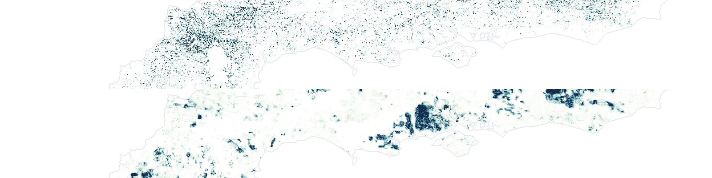

<p align="center">
  
</p>
<p align="center">
  <a href="https://harryjfowen.github.io/wetwoodland-map/">
    
  </a>
</p>

# Mapping the current and potential extent of wet woodland in England to support conservation and restoration

Active codebase for mapping wet woodland extent and restoration suitability across England. Combines label preparation, Google Earth Engine feature extraction, GPU XGBoost modelling, MaxEnt suitability modelling, post-processing, and visualisation.

Developed by Harry Owen (Research Associate, [Royal Holloway, University of London](https://www.royalholloway.ac.uk/)), alongside Associate Professor [Alice Milner](https://pure.royalholloway.ac.uk/en/persons/alice-milner/) (Royal Holloway) and Associate Professor [Emily Lines](https://www.geog.cam.ac.uk/people/lines/) (University of Cambridge), in collaboration with [Forest Research](https://www.forestresearch.gov.uk/). Funded by [Defra](https://www.gov.uk/government/organisations/department-for-environment-food-rural-affairs).

## Repository Layout

```text
wet-woodland-research/
└── wwr/
    ├── code/        # Pipeline scripts
    ├── data/        # Inputs, outputs, and validation assets (not tracked)
    ├── docs/        # Runbooks and methods notes
    ├── visualise/   # Figure rendering scripts
    └── archive/     # Legacy code
```

## Pipeline

Stages run in order from `wwr/code/`:

| Stage | Directory | Description |
|---|---|---|
| 1 | `labels/` | Build training labels from TOW GDB and habitat inputs |
| 2 | `preprocess/` | Build terrain and abiotic predictor layers |
| 3 | `model/` | Train GPU XGBoost extent model |
| 4 | `inference/` | Apply model across embedding tiles |
| 5 | `postprocess/` | Mosaic, threshold, validate, and summarise |
| 6 | `potential/` | MaxEnt suitability modelling |
| 7 | `visualise/` | Publication-ready figures |

## Getting Started

```bash
# Install core dependencies
pip install rasterio geopandas fiona xgboost optuna scikit-learn elapid

# Install visualisation dependencies
pip install -r wwr/visualise/requirements.txt

# Inspect any stage CLI
python wwr/code/potential/maxent.py --help
```

Large inputs and generated outputs are not tracked in git. Populate `wwr/data/input/` and `wwr/data/raw/` locally before running.

## Documentation

- [Workflow runbook](wwr/docs/RUNBOOK.md)
- [Suitability framework](wwr/docs/methods/WET_WOODLAND_SUITABILITY_FRAMEWORK.md)
- [Code index](wwr/code/README.md)
- [Data layout](wwr/data/README.md)

## Output Data

The model outputs are archived and openly available on Zenodo:

[](https://doi.org/10.5281/zenodo.19218648)
